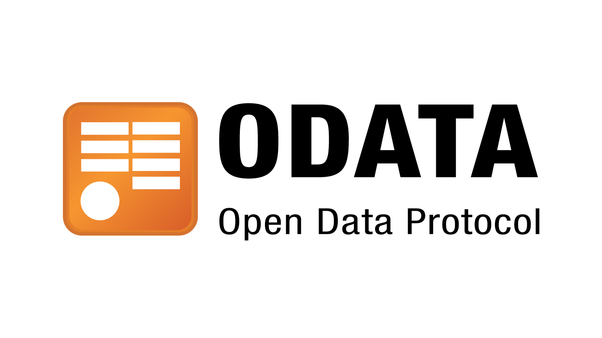

# OData Queries for Northwind Service

 

This document provides the answers to the following queries based on the Northwind service available at https://services.odata.org/northwind/northwind.svc/. Each query is explained below, including the reasoning behind the use of specific OData parameters.

These exercises are part of the tasks for Week 2 of Globant's SAP CAP Bootcamp.

## Queries:

    Retrieve Orders with Customer Details
    Retrieve Employees Reporting to Manager with ID 2
    Retrieve Products with Stock Available
    Retrieve Names and Codes of Products Out of Stock
    Retrieve the Top 5 Most Expensive Products
    Retrieve Orders Shipped to Germany
    Retrieve Names and Prices of Products Shipped to Germany

### Retrieve Orders with Customer Details

#### Query:

    https://services.odata.org/northwind/northwind.svc/Orders?$format=json&$expand=Customer

#### Explanation:

- $expand=Customer: This parameter is used to include related entities, in this case, customer details associated with each order. It joins the Orders and Customer entities to retrieve additional information about customers.

### Retrieve Employees Reporting to Manager with ID 2

#### Query:

    https://services.odata.org/northwind/northwind.svc/Employees?$format=json&$filter=ReportsTo%20eq%202

#### Explanation:

- $filter=ReportsTo=2: Filters the Employees dataset to include only those employees whose ReportsTo field equals 2, identifying employees reporting to the manager with ID 2.

### Retrieve Products with Stock Available

#### Query:

    https://services.odata.org/northwind/northwind.svc/Products?$format=json&$filter=UnitsInStock%20gt%200 

#### Explanation:

 - $filter=UnitsInStock>0: Filters the Products dataset to include only products with UnitsInStock greater than 0, ensuring that only products in stock are returned.

### Retrieve Names and Codes of Products Out of Stock

#### Query:

    https://services.odata.org/northwind/northwind.svc/Products?$format=json&$filter=UnitsInStock%20eq%200&$select=ProductName,ProductID

#### Explanation:

- $filter=UnitsInStock eq 0: Filters the Products dataset to include only products where UnitsInStock equals 0, identifying out-of-stock products.
- $select=ProductName,ProductID: Restricts the response to include only the ProductName and ProductID fields, reducing unnecessary data retrieval.

### Retrieve the Top 5 Most Expensive Products

#### Query:

    https://services.odata.org/northwind/northwind.svc/Products?$format=json&$orderby=UnitPrice%20desc&$top=5

#### Explanation:

- $orderby=UnitPrice desc: Orders the Products dataset by UnitPrice in descending order to prioritize the most expensive products.
- $top=5: Limits the response to the top 5 entries, effectively retrieving the 5 most expensive products.

### Retrieve Orders Shipped to Germany

#### Query:

    https://services.odata.org/northwind/northwind.svc/Orders?$format=json&$filter=ShipCountry%20eq%20'Germany'

#### Explanation:

- $filter=ShipCountry eq 'Germany': Filters the Orders dataset to include only those orders where the ShipCountry is Germany, narrowing down results to orders shipped to this country.

### Retrieve Names and Prices of Products in Beverages Category

#### Query:

    https://services.odata.org/northwind/northwind.svc/Products?$format=json&$select=ProductName,UnitPrice&$expand=Category&$filter=Category/CategoryName%20eq%20'Beverages'

#### Explanation:

- $format=json: Specifies that the response should be formatted in JSON.
- $select=ProductName,UnitPrice: Restricts the response to include only the ProductName and UnitPrice fields from the Products entity, minimizing unnecessary data.
- $expand=Category: Expands the Category navigation property to allow filtering and access to details of the related Category entity.
- $filter=Category/CategoryName eq 'Beverages': Filters the Products dataset to include only those products whose related CategoryName is "Beverages."

## Files

I included a [Postman collection](Requests.postman_collection.json) and a [HTTP request file](requests.http) to be used in [REST Client](https://marketplace.visualstudio.com/items?itemName=humao.rest-client) extension for VSCode.

## General Notes

- $filter: Used to filter datasets based on specific conditions, allowing retrieval of targeted subsets of data.
- $expand: Enables joining related entities, retrieving related data without making multiple queries.
- $orderby: Sorts the dataset based on a specified field, either ascending or descending.
- $top: Limits the number of results returned, useful for pagination or retrieving a fixed number of records.
- $select: Specifies which fields to include in the response, reducing data payload and improving efficiency.
- $skip: Skips a specified number of records from the start of the dataset, commonly used for pagination when combined with $top.

Results are returned in JSON format by default.

## Source information

https://www.odata.org/
